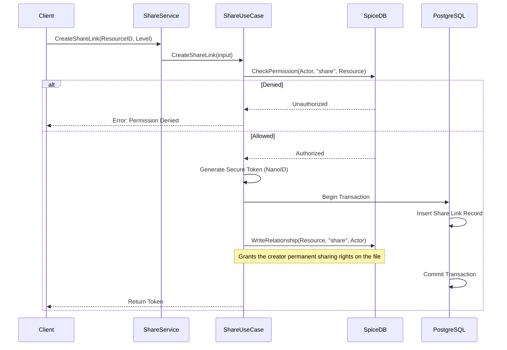
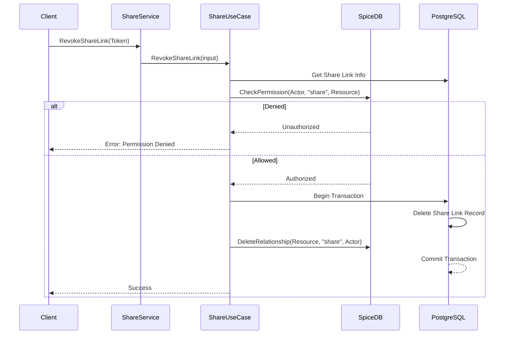
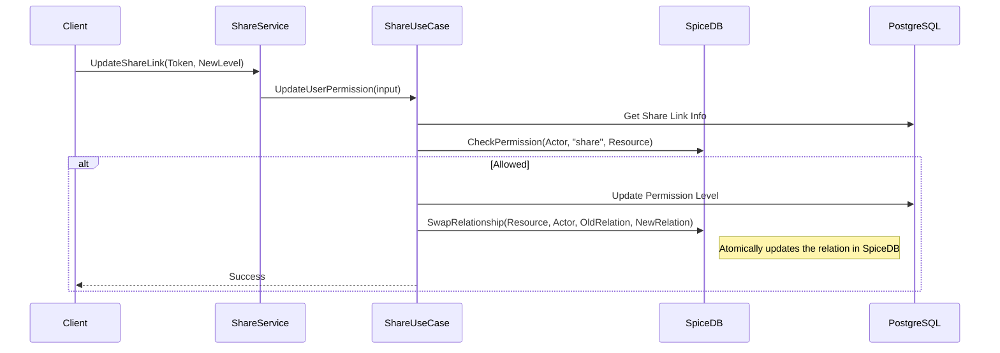
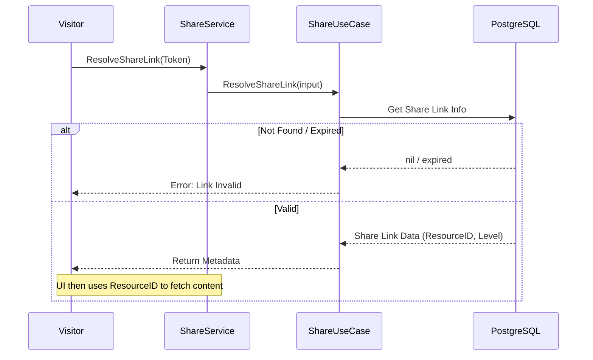

# Architecture Overview

This project implements a secure file storage system with fine-grained access control using **Kratos** for gRPC services, **SpiceDB** (Authzed) for permission management, and **PostgreSQL** for metadata persistence.

## System Architecture

The system follows a layered architecture:
- **API**: gRPC and HTTP definitions (Protobuf).
- **Service**: Implements handlers for File, Share, Plan, Subscription, Dashboard, and Greeter.
- **Biz (Business Logic)**: Core domain logic and permission enforcement using `AuthRepo`.
- **Data (Persistence)**: Implements `Repo` interfaces for SQL (PostgreSQL/TimescaleDB) and Auth (SpiceDB).

> [!NOTE]
> Elasticsearch-based search is currently disabled in favor of database-native queries for the Dashboard.

## File Sharing Flows

The sharing system allows users to create shareable links with specific permission levels (`viewer`, `editor`).

### 1. Create Share Link
This flow generates a secure token and records the intent in both the database and SpiceDB.

### 2. Revoke Share Link
Invalidates a share link and removes the associated permissions.

### 3. Update Share Link Permissions
Changes the access level of an existing share link.

### 4. Resolve Share Link (Visitor Flow)
Allows an anonymous visitor to exchange a token for information about the shared resource.

## Permission Model (SpiceDB)

Permissions are modeled based on the following resources:
- `user`: System users.
- `service`: Machine-to-machine actors.
- `file` / `folder`: Resources being protected.

Common relations:
- `owner`: Full control (Read, Write, Delete, Share).
- `writer`: Can edit and share.
- `viewer`: Read-only access.
- `share`: Explicit permission to manage share links for a resource.
